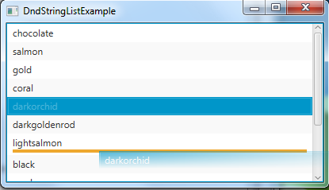
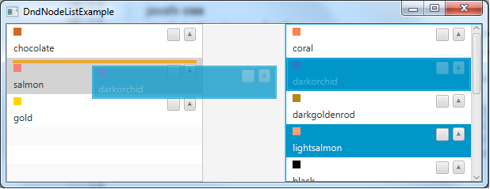

# FxDndListView
JavaFx 8 Drag and Drop ListView control

DndListView extends FX control ListView with drag and drop functionality.

Simple dnd string list view

	DndListView<String> dndListView = new DndListView<String>();
	
	ObservableList<String> data = FXCollections.observableArrayList(
		"chocolate", "salmon", "gold", "coral", "darkorchid",
		"darkgoldenrod", "lightsalmon", "black", "rosybrown",
		"blue", "blueviolet", "brown");
	   	
	dndListView.setItems(data);
	

Done

As data, the component takes any object. In this case [Object] .toString () method is used to display data.

But if javafx.scene.Node is used as data, the node self will be rendered within ListCell.

You can customize the list with CSS, set source and accepted data format or expand the DndListView and override the appropriate methods.

Example dndPanes shows usage interfaces DndSource and DndTarget.

The component uses non-public API of JavaFx 8 and may not work with other versions of JavaFx.

fxDdListView.jar contains binary and source of DndListView.

License: use it.

